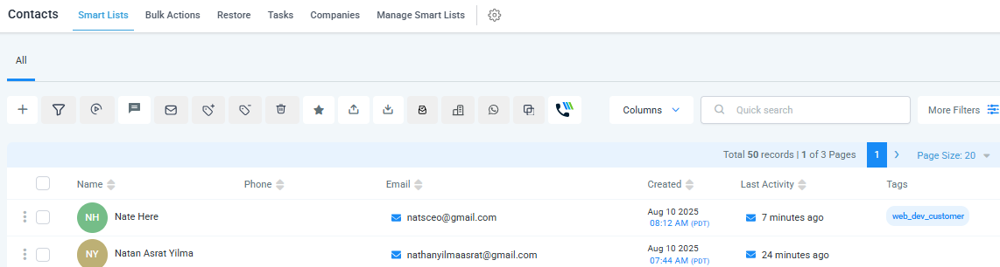
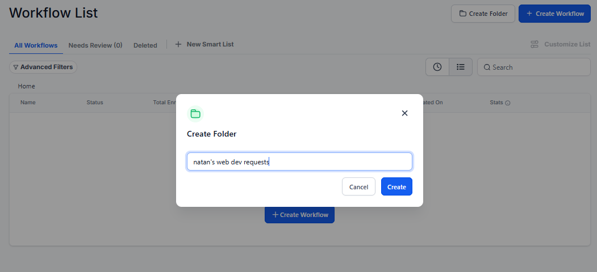

# GoHighLevel Purchase Flow
- User visits a funnel website that presents the service and includes a checkout page, completes payment via PayPal, and receives a confirmation email.

## Input

- Lead completes the Web Development service funnel, enters card details, and submits payment.

    

    

## Output

- Buyer receives a confirmation email.

    

- Contact record is updated with the Web Dev Customer tag.

    

## Steps

- Integrate payment processor by going to Payment -> Integrations -> Paypal

    

    - Go to your paypal sandbox account and create an `app`

    

    

    

    - Copy the client id and secret to ghl.

    

- To add a product go to Payment -> Products

    

    - Write the product info

    

    - Add media by uploading and then selecting it.

    

    - Add your prices.

    

    

    - Select each price and update it's name as well it's type to Digital Product.

    

    

    

    - Check that your product type is Digital

    

- To create coupons go to Payment -> Coupons

    

    

- Create a funnel so users can find and buy your product.

    

    - Add page

    

    - Add a Full width element and in it a 2 column Row. Then on the left add your headline and below it a sub-headline.
    On the right, add an image element. And finally add an order element below the sub-headline.

    

    - Use a 1 step order element since the product is digital and we don't need much information. Hide unnecessary fields by clicking on the order form under General -> Form options

    

    - In the funnel settings, set the Payment mode to `Test`

    

    - Test the website's preview and the coupon code.

    

    

    

    - Check that the order is created in Payments -> Orders or Payments -> Transactions

    

    

- Create a workflow to send a `thank you email`.

    

    - Use `order form submission` trigger

    

    - Send email node

    

    - Add tag to contact so we know they are a web dev customer

    

    - Test.

    

    

    

- If you have a subscription based product, set it as recurring when creating the product and use that product in the funnel. New orders will be found in Payments -> Subscriptions.
- To send invoices for a one time product, go to Payments -> Invoices. Add user, product and click send. Choose Email and finalize.

## Contact
 - LinkedIn: [Natan Asrat](https://linkedin.com/in/natan-asrat)
 - Gmail: nathanyilmaasrat@gmail.com
 - Telegram: [Natan Asrat](https://t.me/fail_your_way_to_success)
 - Youtube: [Natville](https://www.youtube.com/@natvilletutor)
 - Website: [Portfolio](https://natanasrat.com)